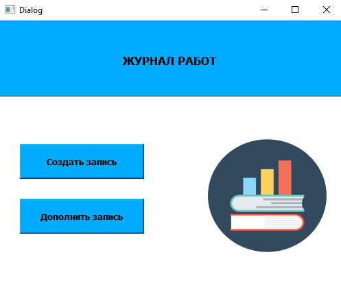
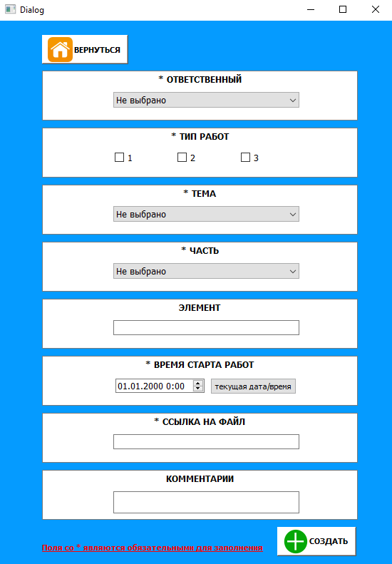
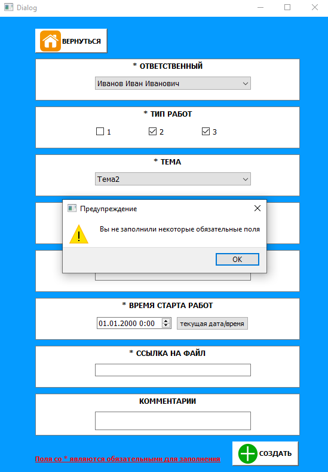
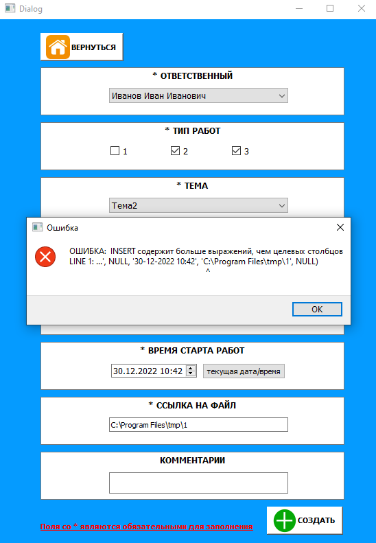
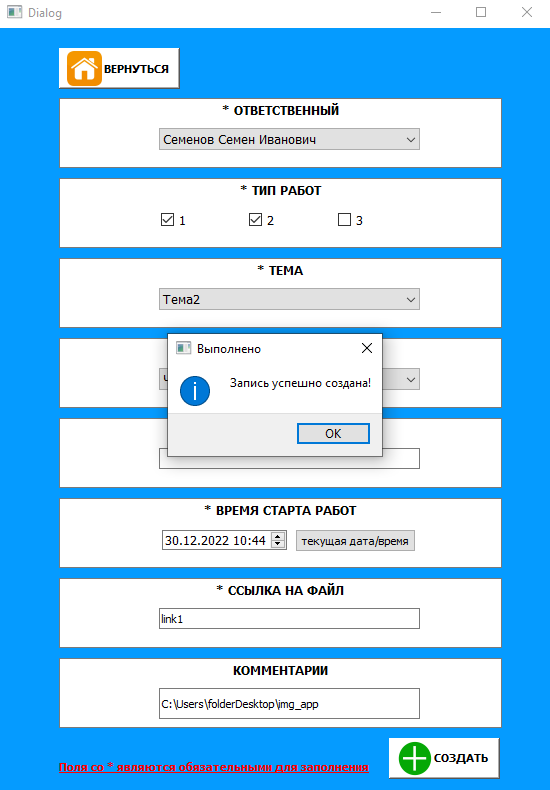
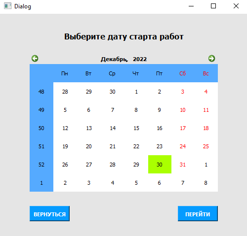
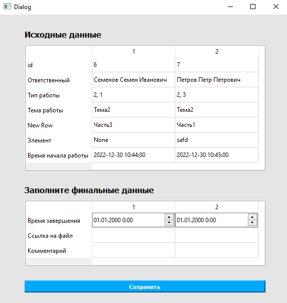
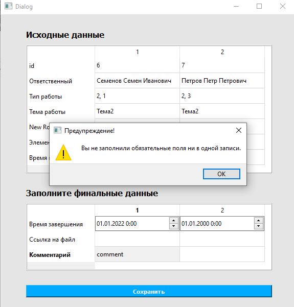
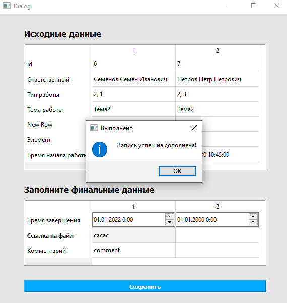

# GUI приложение с использованием PyQT5, QtDesigner и БД PostgreSQL
___
## Приложение для учета (сохранения) записей проводимых работ в БД и их редактирования. 
___
## Requirements

>Установите зависимости из файла requiments.txt:

python-dotenv==0.21.0

PyQt5==5.15.7

PyQt5-Qt5==5.15.2

PyQt5-sip==12.11.0

psycopg2==2.9.5

loguru==0.6.0

> Создайте файл .env с определением переменных окружений по config.py. Внесите его в .gitignore

> Запустите файл first_window.py. Он является исполняемым и запускает инициализацию БД по файлу createdb.sql

> Логирование происходит в файл debug.log (создается автоматически).

___
## Структура

#### PyQt_Journal состоит из 4 основных окон, а также вызываемых модальных (в случае ошибок, предупреждений и информационных сообщений).

```
Стартовое окно. 2 основных сценария: создать новую запись и дополнить (зафиналить) уже существующую запись
```

```
Окно создания записи. Заполняем форму в соответствии с типом полей.
```

```
Модальное окно, всплывающее в случае не заполнения какого-то из обязательных полей (помечены *).
```

```
Модальное окно, всплывающее в случае ошибки при сохранении в БД. Отображает саму ошибку. Данный пример создан искусственно:
```

```
Модальное окно, всплывающее в случае успешного сохранения записи в БД.
```

```
Окно для выбора даты, за которую мы хотим получить список записей для дальнейшего их дополнения. В случае отсутствия записй за период - появится модальное окно с предупреждением
```

```
Окно с 2-мя таблицами с записями за выбранную дату. Верхняя таблица с данными, которые уже заполнили (их нельзя поменять). Нижняя таблица - изменяемая. Для сохранения данных нужно заполнить минимум 2 поля: время (до 2022 года дата считается неактуальной) и ссылка на итоговый файл. В случае незаполнения - всплывет модальное окно с предупреждением. В случае успешного сохранения записи в БД- также появится модальное окно.
```




___
